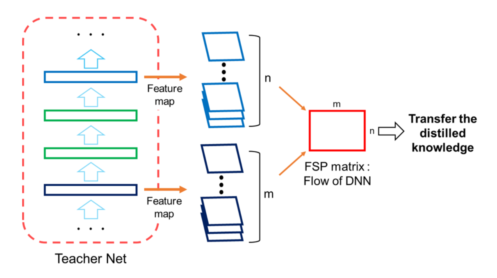
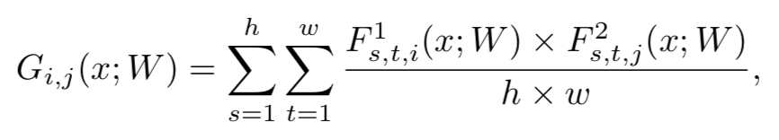
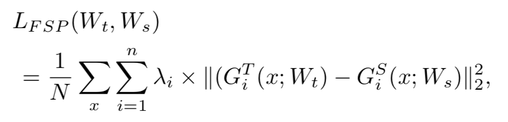
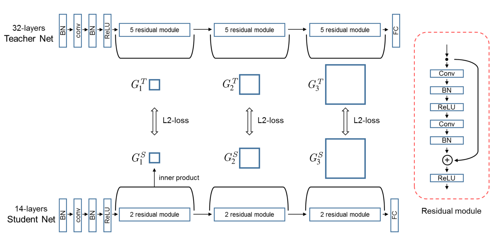

# A Gift from Knowledge Distillation: Fast Optimization, Network Minimization and Transfer Learning

Junho Yim Donggyu Joo Jihoon Bae Junmo Kim

### Introduction

The knowledge transfer performance is very sensitive to how the distilled knowledge is defined. Considering that a real teacher teaches a student the flow for how to solve a problem, we defined high-level distilled knowledge as the flow for solving a problem. Figure 1 shows the concept diagram of our proposed method of transferring distilled knowledge. The extracted feature maps from two
layers are used to generate the flow of solution procedure (FSP) matrix. The student DNN is trained to make its FSP matrix similar to that of the teacher DNN.

### Method

The main concept of our proposed method is how to define the important information of the teacher DNN and transfer the distilled knowledge to the other DNN. If we view the input of the DNN as the question and the output as the answer, we can think of the generated features at the middle of the DNN as the intermediate result in the solution process. Following this idea, the knowledge
transfer technique proposed by Romero et al. [20] lets the student DNN simply mimic the intermediate result of the teacher DNN. However, in the case of the DNN, there are many ways to solve the problem of generating the output from the input. In this sense, mimicking the generated features of the teacher DNN can be a hard constraint for the student DNN.

The student DNN does not necessarily have to learn the intermediate output when the specific question is input but can learn the solution method when
a specific type of question is encountered.

The FSP matrix G ∈Rm×n is calculated by:

The cost function of transferring the distilled knowledge task is defined as:

Note that the pair of layers have the same width and height, if different, we can use maxpooling or 1x1 conv to make it.

### Learning Procedure

The learning procedure contains two stages of training. First, we minimize the loss function LFSP to make the FSP matrix of the student network similar to that of the teacher network. The student network that went through the first stage is now trained by the main task loss at the second stage. 

Note that the datasets to train teacher DNN an student DNN can be different, if the student DNN has a smaller dataset, it's a normal application in transfer learning.

### 感想

优点：提出了一种新的 idea 关于知识的形式，认为知识既不是最终的结果(Hinton KT)，也不是中间结果(FitNet, AT)等，最终的结果诚然重要，但是如果仅仅对最终结果进行模仿，泛化能力会比较差，如果去模仿中间结果，获得最终结果的方式有很多种，对中间结果进行限制又显得过于 Hard, 所以文中给出一种知识的形式，要学习 Flow，我的理解是学习一个变化的趋势，就像文中说的拿出两个 layer 的 feature map 作 inner product 形成 FSP matrice, 这个 FSP matrice 可以看作是从第一个 layer 到第二个 layer 的变化规律，针对 FSP matrice 作 MSE Loss，实则是学习一个变化的规律；给出了一种新的训练的形式，第一个阶段是 student mimic teacher， 第二个阶段是针对 main task 训练，这种训练形式有一个好处，比较适合做 transfer learning，因为 transfer learning 的 target 的 dataset 和 source 的 dataset 一般差别比较大；实验做得比较充分，对实验结果的分析，以及实验的设计比较完整。

缺点：缺乏理论依据，只是一些 intuitive idea；没有与 KT，AT 等方法进行对比；在 CIFAR 100 上结果很好，但在 CIFAR 10 上结果并不是太好，没有给出解释。

[A Gift from Knowledge Distillation: Fast Optimization, Network Minimization and Transfer Learning](http://openaccess.thecvf.com/content_cvpr_2017/papers/Yim_A_Gift_From_CVPR_2017_paper.pdf)

