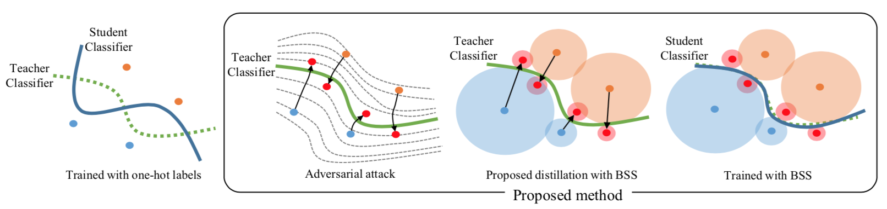
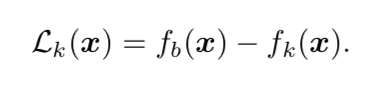
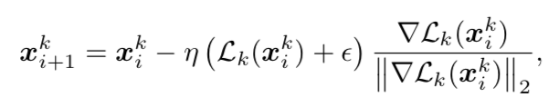
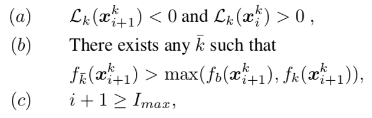
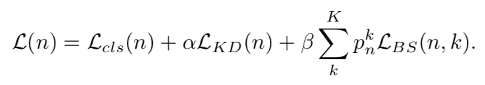
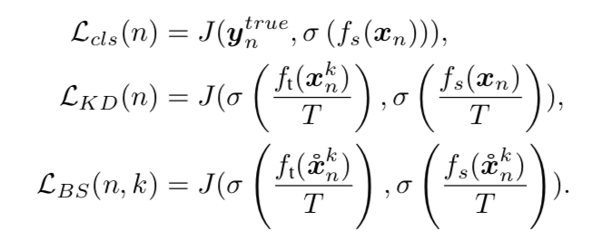
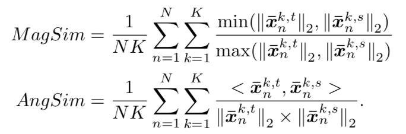

# Knowledge Distillation with Adversarial Samples Supporting Decision Boundary

Byeongho Heo Minsik Lee Sangdoo Yun Jin Young Choi

### Introduction

In general, samples near the decision boundary of a classifier have a larger impact on the performance than those far apart from it (Cortes and Vapnik 1995). Therefore, if we can generate samples close to the decision boundary, the knowledge of a teacher network would be transferred more effectively by utilizing those samples. To obtain the informative samples close to the decision boundary, we utilize an adversarial attack. Inspired by this fact, we propose to perform knowledge distillation with the help of an adversarial attack. The resulting sample is referred to as the boundary supporting sample (BSS) in this paper. 

### Benefits of BSSs in knowledge distillation

A boundary supporting sample (BSS) is defined in this respect, it is an adversarial sample that lies near the decision boundary of a teacher classifier. Since BSSs are labeled samples near decision boundary as depicted in the second picture of Figure 1, they contain the information about the decision boundary.

### Iterative Scheme to find a BSS

The loss function for the attack to the target class k is defined by

This loss becomes zero at a point on the decision boundary, positive at a point within the base class, and negative at an adversarial point within the target class. 

To find an adversarial sample, we move the sample to the direction minimizing
the loss by the iterative scheme in

The iteration stops if one of the following conditions occurs:

### Knowledge distillation using BSS

The proposed loss function to train the student classifier combines
three losses:

 each loss is defined by:

### Metrics for similarity of decision boundaries

The similarity between the two decision boundaries is defined by two metrics: The Magnitude Similarity (MagSim) and the Angle similarity (AngSim) in:

Note that MagSim represents the similarity with respect to the distance from the base sample to the decision boundary. and AngSim depicts that with respect to the path direction from the base sample to the boundary. 

### 感想：

优点：Idea 很新颖，蒸馏问题的关键之一就是如何去定义知识，本篇论文给出的答案是 decision boundary，如果 student 能够学到像 teacher 一样的 decision boundary，那么在处理边界附近的点就会有更高的成功率，也就是说泛化能力会更强，这一点可以参考 SVM 里面边界取得越好，泛化能力越强；从 decision boundary 出发，延伸出来的问题是怎么取学到它，文章中给出的答案是使用 adversarial sample，当 teacher 无法去分类对抗样本时，说明对抗样本在边界上，这个是符合直觉的，文章中也给出了图示；进而衍生的问题是，如何生成对抗样本，文章中采用迭代的方式，从一个 base sample 出发，经过数轮迭代生成对抗样本；如何去学习决策边界，文中加了一个新的 loss，名为 BS Loss，其实就是 teacher 网络对 adversarial sample 的输出结果和 student 网络相应输出结果的 cross entropy；文章中对一些细节问题处理得很好，比如迭代何时停止，迭代是否有效，迭代的步长，BS loss 中的概率等；文中给出的 metrics 去衡量学习决策边界的好坏很有意思，分别衡量了 base sample 到决策边界的距离和方向，并对比了 KT 和文中提出的方法，给出了 KT 的问题所在；文章实验很充分，用了很多数据集，与 KT, fitnet, fsp 等方法进行对比，并对比了产生对抗样本的不同方法。

缺点：使用的数据集过小，无法证明在大规模数据集上的适用性；决策边界只能适用于分类问题，在回归等其他问题上不适用，当然这个缺点 KT 也有；提升效果并不是很明显。

[Knowledge Distillation with Adversarial Samples Supporting Decision Boundary](https://arxiv.org/abs/1805.05532)