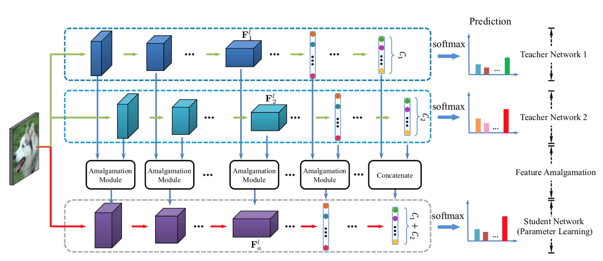
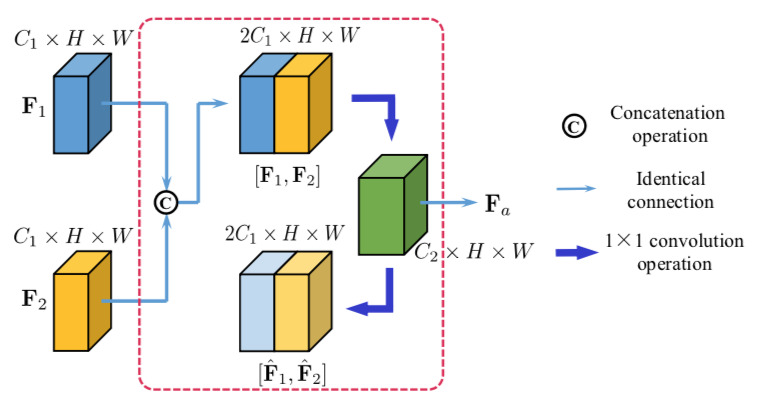
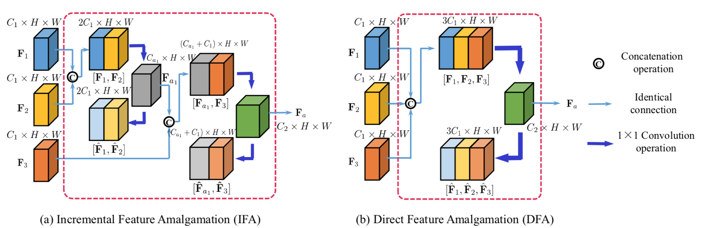
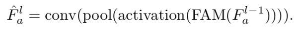
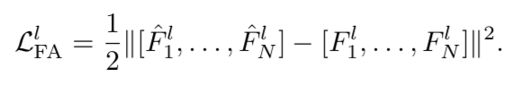
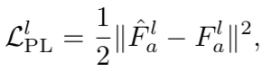

# Amalgamating Knowledge towards Comprehensive Classification

Chengchao Shen1, Xinchao Wang2, Jie Song1, Li Sun1, Mingli Song1

#### Introduction

Given multiple trained teacher networks, each of which specializes in a different classification problem, the goal of knowledge amalgamation is to learn a lightweight student model capable of handling the comprehensive classification. In other words, the classification problem addressed by the student is the superset of those by all the teachers. 

Our approach comprises two steps, feature amalgamation and parameter learning. The feature amalgamation step first extracts features of the multiple teachers, obtained by feeding input samples to the teachers, and then compresses the stacked features into a compact and discriminative set. The obtained set of features are then used as the supervision information for learning the network
parameters in a layer-wise manner in the parameter learning step. 

#### Knowledge Amalgamation Task

The overall process of the knowledge amalgamation, in the case of two teacher models, is shown in Figure 1.

##### Amalgamation from Two Teacher Models

A straightforward amalgamation approach would be to directly concatenate the feature sets, obtained by feeding inputs to the teacher models, on the same layer of the two teachers. In this way, however, the obtained student model would be very cumbersome.To this end, we apply an auto-encoder architecture that compresses the concatenated features from the two teachers, as depicted in Figure 2. 

##### Amalgamation from Multiple Teacher Models

- Incremental Feature Amalgamation (IFA): we conduct amalgamation in a progressive manner, by each time amalgamating two sets of feature maps.
- DirectFeatureAmalgamation(DFA):we directly amalgamate feature maps from multiple teachers.

Although the architecture of DFA is more intuitively straightforward, IFA is in fact easier to generalize as the same auto-encoder can be repetitively adopted and thus extended to arbitrary number of teachers, while DFA needs to retrain the whole auto-encoder when a new teacher is added.

##### Amalgamation of Score Vectors

For disjoint teacher models that handle non-overlapping classes, we directly concatenate their score vectors as the amalgamated one, and use the amalgamated score vector as the target for the student.

#### Parameter Learning

##### Layer-wise Parameter Learning

In the layer-wise parameter learning step, Fl−1 is a fed as input and goes through a series of operations includ- ing pooling, activation and convolution to approximate Fal.The goal of the layer-wise learning stage is to obtain the weights of the convolutional layer. This leads to a linear optimization problem, which is much easier to be solved than optimizing all the parameters of the network jointly. However, the non- parametric layers may remove some discriminant information from F l−1 , making the parameter learning troublesome. A 1 × 1 convolution operation is adopted to implement FAM.

##### Joint Parameter Learning

After the layer-wise learning, we look at all the parameters simultaneously and train them end to end.

#### Loss Functions

##### Loss of Feature Amalgamation

##### Loss of Parameter Learning

#### 感想

优点：知识整合这个 idea 非常新颖，使用一些不同用途的老师教一个学生，使得学生具有多方面的能力；在细节方面处理地很好，比如两阶段训练，特征整合和参数学习，在特征整合时使用了 AutoEncoder 结构来降维，提出了多老师的 IFA, DFA 整合方式，Score 的整合也考虑了 non-overlapping, overlapping 两种情况，在参数学习时提出了用 FAM 来降低信息的丢失等。

缺点：有个别语法错误，比如第二页的 turns out to effective 等；没有理论支撑；实验集太小，没有用一些主流的数据集。

[Amalgamating Knowledge towards Comprehensive Classification](https://arxiv.org/abs/1811.02796)
