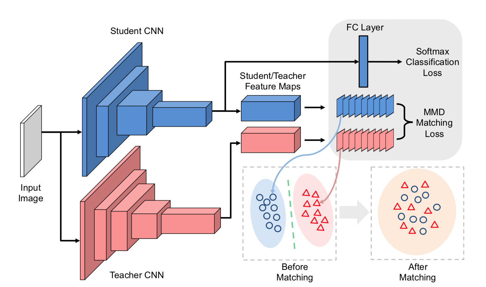
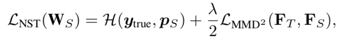
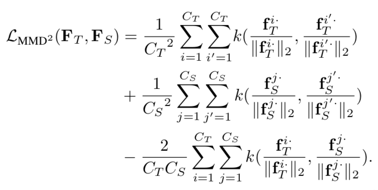
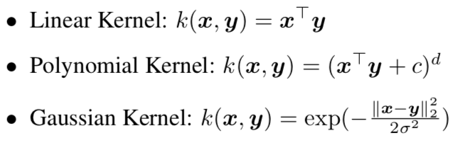

# Like What You Like: Knowledge Distill via Neuron Selectivity Transfer

**Zehao Huang Naiyan Wang**

#### Introduction

In this work, we explore a new type of knowledge in teacher models, and transfer it to student models.Specifically, we make use of the selectivity knowledge of neurons. The intuition behind this model is rather straightforward: Each neuron essentially extracts a certain pattern related to the task at hand from raw input. Thus, if a neuron is activated in certain regions or samples, that implies these regions or samples share some common properties that may relate to the task. Such clustering knowledge is valuable for the student network since it provides an explanation to the final prediction of the teacher model. As a result, we propose to align the distribution of neuron selectivity pattern between student models and teacher models.

Maximum Mean Discrepancy (MMD) is used as the loss function to measure the discrepancy between teacher and student features. 

In the literature, Maximum Mean Discrepancy (MMD) is a widely used criterion, which compares distributions in the Reproducing Kernel Hilbert Space (RKHS) [12]. Several works have adopted MMD to solve the domain shift problem.

#### Neuron Selectivity Transfer

1. In order to capture these similarities, there should be also neurons mimic these activation patterns in student networks. These observations guide us to define a new type of knowledge in teacher networks: neuron selectivities or called coactivations, and then transfer it to student networks.
2. As for distribution matching, it is not a good choice to directly match the samples from it, since it ignores the sample density in the space.

#### Formulation

Following the notation in Sec. 3.1, each feature map fk· represents the selectivity knowledge of a specific neuron. Then we can define Neuron Selectivity Transfer loss as:

The MMD loss can be expanded as:

Kernel Tricks:

#### 感想

优点：借鉴了很多 Domain adaptation, Transfer Learning 里面的东西，给 distill 提供了一些新的 idea, 使用了 Kernel Trick 增加了可扩展性，提供了直观上的理解为什么去使用 NST, 而不是直接用 Feature Map 做一个 MSE Loss，把一个迁移问题看作是一个 Distribution Match 的问题，是一个新颖的角度，神经网络本身就是在学习一种分布。

缺点：所用的知识形式和 Attention Transfer 里差别并不大，如果说 AT 里面使用的知识是一种 Spatial Attention 的话，本文使用的知识应该是一种 Channel Attention，在分类问题上的效果提升并不很明显，与其他方法并不正交。

[Like What You Like: Knowledge Distill via Neuron Selectivity Transfer](https://arxiv.org/abs/1707.01219)
