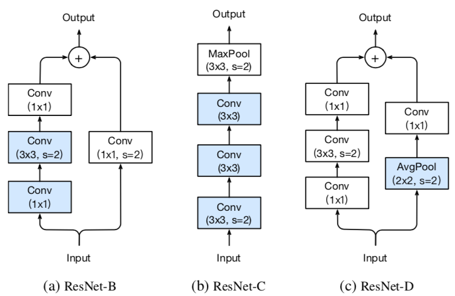
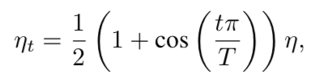
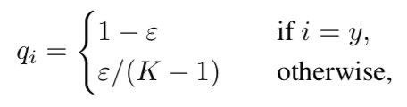
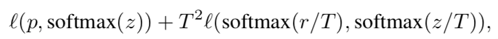
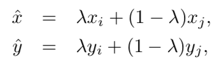

# Bag of Tricks for Image Classification with Convolutional Neural Networks

**Tong He Zhi Zhang Hang Zhang Zhongyue Zhang Junyuan Xie Mu Li**

#### Introduction

For example, we raise ResNet-50’s top-1 validation accuracy
from 75.3% to 79.29% on ImageNet.

However, these advancements did not solely come from improved model architecture. Training procedure refinements, including changes in loss functions, data preprocessing, and optimization methods also played a major role.

#### Efficient Training

1. **Linear scaling learning rate.** A large batch size reduces the noise in the gradient, so we may increase the learning rate to make a larger progress along the opposite of the gradient direction. In particular, if we follow He et al. [9] to choose 0.1 as the initial learn- ing rate for batch size 256, then when changing to a larger batch size b, we will increase the initial learning rate to 0.1 × b/256. 
2. **Learning rate warmup.** Using a too large learning rate may result in numerical instability. Assume we will use the first m batches (e.g. 5 data epochs) to warm up, and the initial learning rate is η, then at batch i, 1 ≤ i ≤ m, we will set the learning rate to be iη/m. 
3. **Zero γ.** Given input x, assume block(x) is the output for the
   last layer in the block, this residual block then outputs x + block(x). In the zero γ initialization heuristic, we initialize γ = 0 for all BN layers that sit at the end of a residual block. Therefore, all residual blocks just return their inputs, mimics network that has less number of layers and is easier to train at the initial stage.
4. **No bias decay.** The weight decay is often applied to all learnable parameters including both weights and bias. The no bias decay heuristic follows this recommendation, it only applies the weight decay to the weights in convolution and fully-connected layers. 
5. **Low-precision training.** Micikevicius et al. [19] proposes to store all parameters and activations in FP16 and use FP16 to compute gradients. At the same time, all parameters have an copy in FP32 for parameter updating.

#### Model Tweaks

1. **ResNet-B.** The observation is that the convolution in path A ignores three-quarters of the input feature map because it uses a kernel size 1×1 with a stride of 2. ResNet-B switches the strides size of the first two convolutions in path A, as shown in Figure 2a, so no information is ignored.

2. **ResNet-C.** The observation is that the computational cost of a convolution is quadratic to the kernel width or height. A 7 × 7 convolution is 5.4 times more expensive than a 3 × 3 convolution. So this tweak replacing the 7 × 7 convolution in the input stem
   with three conservative 3 × 3 convolutions.

3. **ResNet-D.** Inspired by ResNet-B, we note that the 1 × 1 convolution in the path B of the downsampling block also ignores 3/4 of input feature maps, we would like to modify it so no information will be ignored. Empirically, we found adding a 2×2 average pooling layer with a stride of 2 before the convolution, whose stride is changed to 1, works well
   in practice and impacts the computational cost little. 

   

#### Training Refinements

1. **Cosine Learning Rate Decay.** He et al. [9] decreases rate at 0.1 for ev-
   ery 30 epochs, we call it “step decay”. Szegedy et al. [26] decreases rate at 0.94 for every two epochs.Loshchilov et al. [18] propose a cosine annealing strategy. where η is the initial learning rate. 
2. **Label Smoothing.** The idea of label smoothing was first proposed to train Inception-v2 [26]. It changes the construction of the true
   probability to
3. **Knowledge Distillation.** During training, we add a distillation loss to penalize the difference between the softmax outputs from the teacher
   model and the learner model.
4. **Mixup Training.** Here we consider another augmentation method called mixup [29]. In mixup, each time we randomly sample two examples (xi , yi ) and (xj , yj ). Then we form a new example by a weighted linear interpolation of these two examples:

[Bag of Tricks for Image Classification with Convolutional Neural Networks](https://arxiv.org/pdf/1812.01187.pdf)

 